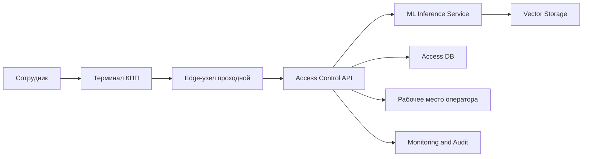

# Кейс №2. Система идентификации личности по фотографии для контроля доступа

## Состав команды и роли

Проект подготовлен командой из трех человек:

| Участник | Роль в проекте | Зона ответственности |
| --- | --- | --- |
| Егор | Product Owner / системный аналитик | бизнес-цели, требования, сценарии использования, критерии пилота |
| Артём | Data Scientist / ML-инженер | ML-подход, метрики качества, риски модели, план экспериментов |
| Максим | Data Engineer / Data Architect | данные, архитектура хранения, интеграции, эксплуатация и безопасность |

## Краткое описание продукта

Мы проектируем информационную систему с ИИ-модулем для автоматической идентификации сотрудников предприятия по фотографии на проходной. Сейчас сотрудник проходит через КПП по пластиковому пропуску, а дежурный вручную сравнивает лицо человека с фотографией в профиле. Такой процесс медленный, зависит от внимательности оператора и плохо масштабируется на 10 проходных.

Предлагаемая система делает процесс более быстрым и контролируемым: камера на КПП получает изображение лица, ML-сервис сравнивает его с биометрическими шаблонами сотрудников, система принимает решение о допуске или передает спорный случай оператору. При этом важная часть проекта — не заменить человека любой ценой, а убрать рутинные проверки и оставить ручное участие там, где оно действительно нужно.

## Цель проекта

Создать проект ML-системы, которая:

- сокращает время прохода сотрудников через КПП;
- снижает субъективность ручной проверки;
- повышает защищенность предприятия от прохода по чужому пропуску;
- сохраняет аудит действий и решений системы;
- учитывает требования к персональным и биометрическим данным.

## Основные документы

- [Полный дизайн-документ MLSD](docs/design-document.md)
- [Требования к системе](docs/requirements.md)
- [Методология ML и данные](docs/ml-methodology.md)
- [Пилот и критерии успеха](docs/pilot.md)
- [Production-внедрение и эксплуатация](docs/production.md)
- [Риски и меры снижения](docs/risks.md)
- [MVP и технический долг](docs/mvp-and-tech-debt.md)
- [Сценарий защиты на 5 минут](docs/presentation-script.md)
- [Word-отчет](report/MLSD_case2_face_access_control.docx)

## Диаграммы

| Модель | Файл | Назначение |
| --- | --- | --- |
| Бизнес-процесс AS-IS | [diagrams/business-process-as-is.mmd](diagrams/business-process-as-is.mmd) | показывает текущую ручную проверку на КПП |
| Бизнес-процесс TO-BE | [diagrams/business-process-to-be.mmd](diagrams/business-process-to-be.mmd) | показывает процесс после внедрения системы |
| ER-диаграмма данных | [diagrams/data-er-diagram.mmd](diagrams/data-er-diagram.mmd) | описывает структуру данных и связи сущностей |
| Архитектура системы | [diagrams/system-architecture.mmd](diagrams/system-architecture.mmd) | показывает распределенную архитектуру на 10 проходных |
| UML-диаграмма компонентов | [diagrams/uml-components.mmd](diagrams/uml-components.mmd) | показывает основные программные компоненты |
| UML-поведенческая диаграмма | [diagrams/uml-sequence-access.mmd](diagrams/uml-sequence-access.mmd) | показывает сценарий прохода сотрудника |

## Почему используется ML

Задача не сводится к обычной проверке пропуска. Пропуск можно передать другому человеку, потерять или использовать без фактического подтверждения личности. ML-модуль решает именно задачу сопоставления лица с учетной записью сотрудника: извлекает биометрический вектор из фотографии и сравнивает его с эталонными шаблонами.

Важно, что мы проектируем не «черный ящик», а управляемую информационную систему: с порогами уверенности, ручным подтверждением спорных случаев, журналированием, мониторингом качества и регулярным обновлением эталонных данных.

## Ключевые проектные решения

- Тип ML-задачи: face verification и face identification.
- Основной сценарий MVP: сотрудник прикладывает пропуск, система проверяет, что лицо соответствует владельцу пропуска.
- Расширенный сценарий: поиск личности по базе сотрудников без прикладывания пропуска.
- Архитектура: гибридная, с edge-узлами на проходных и центральными сервисами.
- Хранение данных: отдельно кадровые данные, биометрические шаблоны, события доступа и аудит.
- Режим отказа: при сбое камеры, сети или низкой уверенности решение передается оператору.

## Критерии успешного пилота

Пилот проводится на 1-2 проходных и ограниченной группе сотрудников. Успех пилота считаем достигнутым, если:

- среднее время проверки не превышает 2 секунд;
- доля ложных отказов не выше 1-2% после настройки порога;
- ложные допуски в пилоте отсутствуют или находятся ниже согласованного порога безопасности;
- не менее 90% штатных проходов обрабатываются без ручного вмешательства;
- операторы понимают интерфейс и не обходят систему в обычной работе.

## Архитектура в одном взгляде



## Что сдавать в ответ на задание

В ответ на задание все участники команды отправляют одинаковый текст:

```text
Ссылка на репозиторий с мастер-документом и диаграммами:
<сюда вставить ссылку на GitHub-репозиторий>

Ссылка на видео выступления:
<сюда вставить ссылку, если видео будет записано>
```

Если видео не записывается, вторую строку можно заменить на: «Видео выступления не записывалось, защита будет проведена очно/онлайн с демонстрацией репозитория».
