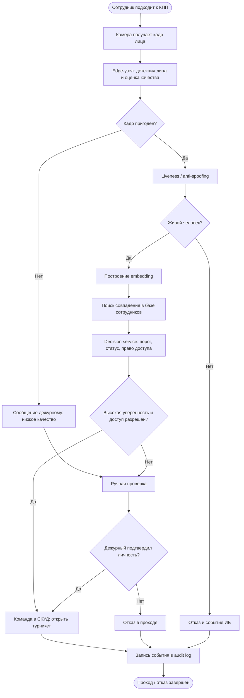
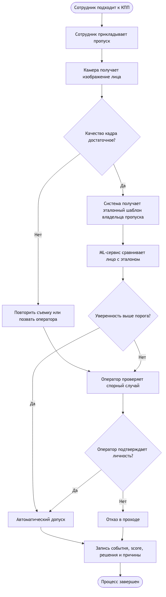

# Бизнес-процесс после внедрения системы

```mermaid
flowchart TD
    A([Сотрудник подходит к КПП]) --> B[Камера получает кадр лица]
    B --> C[Edge-узел: детекция лица и оценка качества]
    C --> D{Кадр пригоден?}
    D -- Нет --> E[Сообщение дежурному: низкое качество]
    E --> F[Ручная проверка]
    D -- Да --> G[Liveness / anti-spoofing]
    G --> H{Живой человек?}
    H -- Нет --> I[Отказ и событие ИБ]
    H -- Да --> J[Построение embedding]
    J --> K[Поиск совпадения в базе сотрудников]
    K --> L[Decision service: порог, статус, право доступа]
    L --> M{Высокая уверенность и доступ разрешен?}
    M -- Да --> N[Команда в СКУД: открыть турникет]
    M -- Нет --> F
    F --> O{Дежурный подтвердил личность?}
    O -- Да --> N
    O -- Нет --> P[Отказ в проходе]
    N --> Q[Запись события в audit log]
    P --> Q
    I --> Q
    Q --> R([Проход / отказ завершен])
```

Исходник диаграммы: [diagrams/source/business-process-to-be.mmd](../../diagrams/source/business-process-to-be.mmd)
