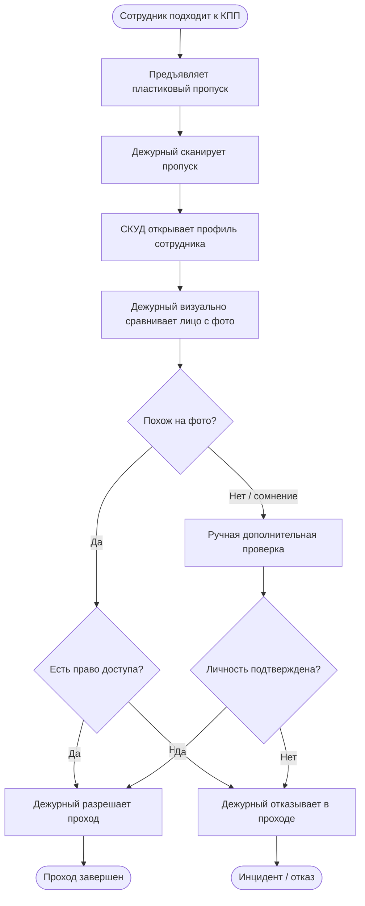
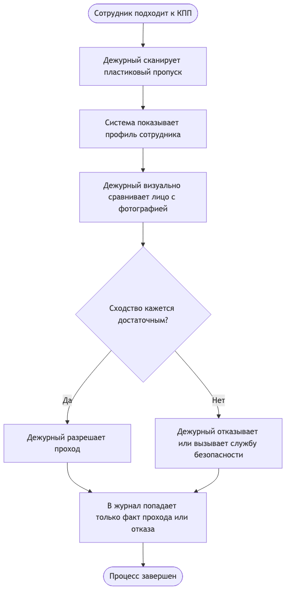

# Бизнес-процесс до внедрения системы

```mermaid
flowchart TD
    A([Сотрудник подходит к КПП]) --> B[Предъявляет пластиковый пропуск]
    B --> C[Дежурный сканирует пропуск]
    C --> D[СКУД открывает профиль сотрудника]
    D --> E[Дежурный визуально сравнивает лицо с фото]
    E --> F{Похож на фото?}
    F -- Да --> G{Есть право доступа?}
    G -- Да --> H[Дежурный разрешает проход]
    G -- Нет --> I[Дежурный отказывает в проходе]
    F -- Нет / сомнение --> J[Ручная дополнительная проверка]
    J --> K{Личность подтверждена?}
    K -- Да --> H
    K -- Нет --> I
    H --> L([Проход завершен])
    I --> M([Инцидент / отказ])
```

Исходник диаграммы: [diagrams/source/business-process-as-is.mmd](../../diagrams/source/business-process-as-is.mmd)
