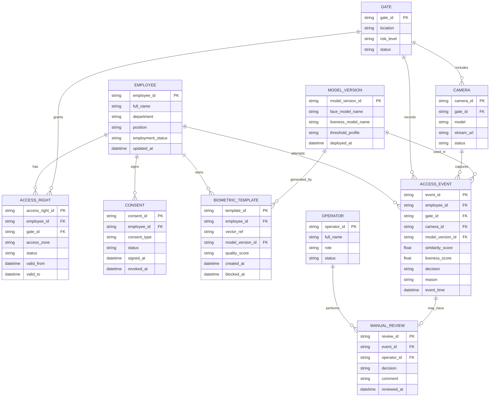

# Структура данных

```mermaid
erDiagram
    EMPLOYEE ||--o{ ACCESS_RIGHT : has
    EMPLOYEE ||--o{ CONSENT : signs
    EMPLOYEE ||--o{ BIOMETRIC_TEMPLATE : owns
    EMPLOYEE ||--o{ ACCESS_EVENT : attempts
    GATE ||--o{ CAMERA : includes
    GATE ||--o{ ACCESS_RIGHT : grants
    GATE ||--o{ ACCESS_EVENT : records
    CAMERA ||--o{ ACCESS_EVENT : captures
    MODEL_VERSION ||--o{ BIOMETRIC_TEMPLATE : generated_by
    MODEL_VERSION ||--o{ ACCESS_EVENT : used_in
    OPERATOR ||--o{ MANUAL_REVIEW : performs
    ACCESS_EVENT ||--o| MANUAL_REVIEW : may_have

    EMPLOYEE {
        string employee_id PK
        string full_name
        string department
        string position
        string employment_status
        datetime updated_at
    }

    CONSENT {
        string consent_id PK
        string employee_id FK
        string consent_type
        string status
        datetime signed_at
        datetime revoked_at
    }

    BIOMETRIC_TEMPLATE {
        string template_id PK
        string employee_id FK
        string vector_ref
        string model_version_id FK
        string quality_score
        datetime created_at
        datetime blocked_at
    }

    ACCESS_RIGHT {
        string access_right_id PK
        string employee_id FK
        string gate_id FK
        string access_zone
        string status
        datetime valid_from
        datetime valid_to
    }

    GATE {
        string gate_id PK
        string location
        string risk_level
        string status
    }

    CAMERA {
        string camera_id PK
        string gate_id FK
        string model
        string stream_url
        string status
    }

    ACCESS_EVENT {
        string event_id PK
        string employee_id FK
        string gate_id FK
        string camera_id FK
        string model_version_id FK
        float similarity_score
        float liveness_score
        string decision
        string reason
        datetime event_time
    }

    MANUAL_REVIEW {
        string review_id PK
        string event_id FK
        string operator_id FK
        string decision
        string comment
        datetime reviewed_at
    }

    OPERATOR {
        string operator_id PK
        string full_name
        string role
        string status
    }

    MODEL_VERSION {
        string model_version_id PK
        string face_model_name
        string liveness_model_name
        string threshold_profile
        datetime deployed_at
    }
```
