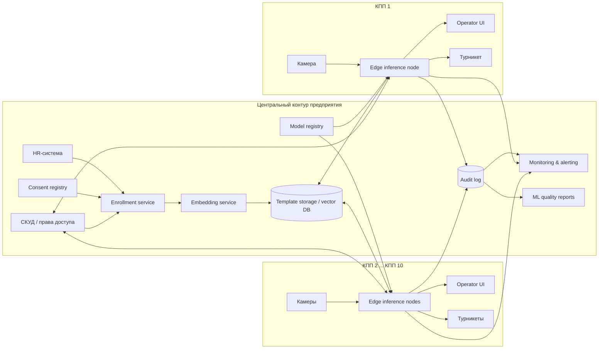
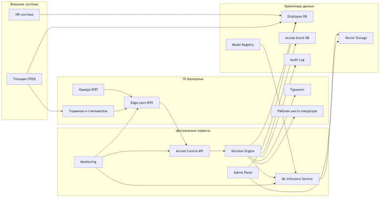

# Архитектура системы

```mermaid
flowchart LR
    subgraph HR["Центральный контур предприятия"]
        HRS[HR-система]
        CONS[Consent registry]
        ACS[СКУД / права доступа]
        ENR[Enrollment service]
        EMB[Embedding service]
        TS[(Template storage / vector DB)]
        AUD[(Audit log)]
        MON[Monitoring & alerting]
        MR[Model registry]
        REP[ML quality reports]
    end

    subgraph G1["КПП 1"]
        CAM1[Камера]
        EDGE1[Edge inference node]
        UI1[Operator UI]
        TURN1[Турникет]
    end

    subgraph G2["КПП 2 ... КПП 10"]
        CAM2[Камеры]
        EDGE2[Edge inference nodes]
        UI2[Operator UI]
        TURN2[Турникеты]
    end

    HRS --> ENR
    CONS --> ENR
    ACS --> ENR
    ENR --> EMB
    EMB --> TS
    MR --> EDGE1
    MR --> EDGE2
    TS <--> EDGE1
    TS <--> EDGE2
    ACS <--> EDGE1
    ACS <--> EDGE2
    CAM1 --> EDGE1
    CAM2 --> EDGE2
    EDGE1 --> TURN1
    EDGE2 --> TURN2
    EDGE1 --> UI1
    EDGE2 --> UI2
    EDGE1 --> AUD
    EDGE2 --> AUD
    AUD --> MON
    AUD --> REP
    EDGE1 --> MON
    EDGE2 --> MON
```

Исходник диаграммы: [diagrams/source/system-architecture.mmd](../../diagrams/source/system-architecture.mmd)
