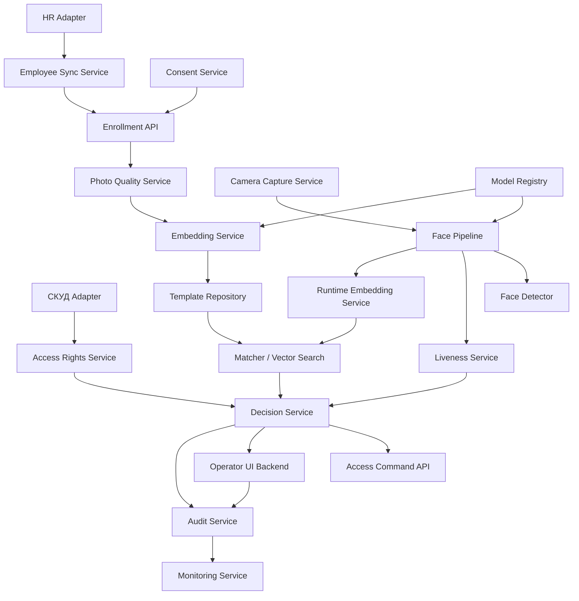

# UML-диаграмма компонентов

```mermaid
flowchart TD
    HR[HR Adapter] --> SYNC[Employee Sync Service]
    SCUD[СКУД Adapter] --> RIGHTS[Access Rights Service]
    CONS[Consent Service] --> ENR[Enrollment API]
    SYNC --> ENR
    RIGHTS --> DEC[Decision Service]
    ENR --> QUAL[Photo Quality Service]
    QUAL --> EMB[Embedding Service]
    EMB --> TPL[Template Repository]

    CAM[Camera Capture Service] --> FP[Face Pipeline]
    FP --> DET[Face Detector]
    FP --> LIVE[Liveness Service]
    FP --> EMB2[Runtime Embedding Service]
    EMB2 --> MATCH[Matcher / Vector Search]
    TPL --> MATCH
    MATCH --> DEC
    LIVE --> DEC
    DEC --> SCUDCMD[Access Command API]
    DEC --> OUI[Operator UI Backend]
    DEC --> AUD[Audit Service]
    OUI --> AUD
    AUD --> MON[Monitoring Service]
    REG[Model Registry] --> FP
    REG --> EMB
```
