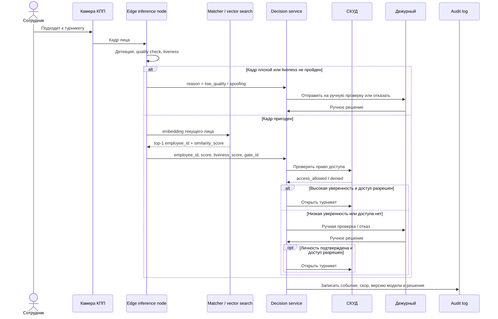
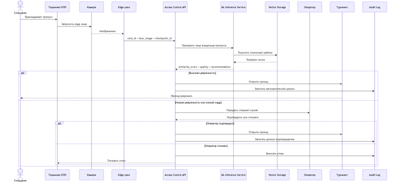

# Поведенческая UML-диаграмма

```mermaid
sequenceDiagram
    actor Employee as Сотрудник
    participant Camera as Камера КПП
    participant Edge as Edge inference node
    participant Matcher as Matcher / vector search
    participant Decision as Decision service
    participant ACS as СКУД
    participant Operator as Дежурный
    participant Audit as Audit log

    Employee->>Camera: Подходит к турникету
    Camera->>Edge: Кадр лица
    Edge->>Edge: Детекция, quality check, liveness

    alt Кадр плохой или liveness не пройден
        Edge->>Decision: reason = low_quality / spoofing
        Decision->>Operator: Отправить на ручную проверку или отказать
        Operator->>Decision: Ручное решение
    else Кадр пригоден
        Edge->>Matcher: embedding текущего лица
        Matcher-->>Edge: top-1 employee_id + similarity_score
        Edge->>Decision: employee_id, score, liveness_score, gate_id
        Decision->>ACS: Проверить право доступа
        ACS-->>Decision: access_allowed / denied

        alt Высокая уверенность и доступ разрешен
            Decision->>ACS: Открыть турникет
        else Низкая уверенность или доступа нет
            Decision->>Operator: Ручная проверка / отказ
            Operator->>Decision: Ручное решение
            opt Личность подтверждена и доступ разрешен
                Decision->>ACS: Открыть турникет
            end
        end
    end

    Decision->>Audit: Записать событие, скор, версию модели и решение
```

Исходник диаграммы: [diagrams/source/uml-sequence-access.mmd](../../diagrams/source/uml-sequence-access.mmd)
