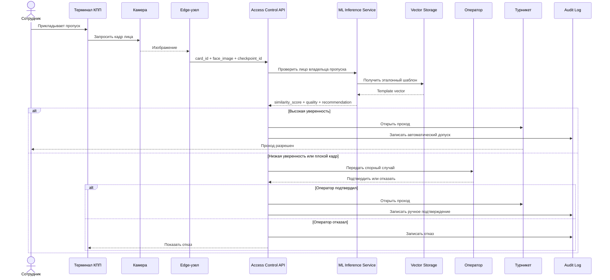

# UML-последовательность для сценария MVP

Поведенческая модель проверки «пропуск + лицо» на этапе пилота.

Исходник диаграммы: [diagrams/source/uml-sequence-access.mmd](../../diagrams/source/uml-sequence-access.mmd)
