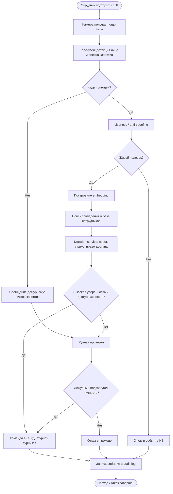

# Бизнес-процесс после внедрения системы

Диаграмма показывает целевой процесс: ML-система берет на себя первичную идентификацию личности, проверку liveness и применение порогов уверенности. Дежурный остается в контуре для спорных случаев и отказов системы.

## Что меняет информационная система

- Ручное визуальное сравнение заменяется автоматической идентификацией по фотографии.
- Вводятся формальные пороги уверенности и единый decision service.
- Все спорные случаи переводятся в ручную проверку, поэтому ML не является безусловным единственным решением.
- Появляются журналы событий, метрики качества, причины отказов и история ручных override-решений.
- Обработка видеокадра выполняется на edge-узле КПП, что снижает задержку и зависимость от центральной сети.
