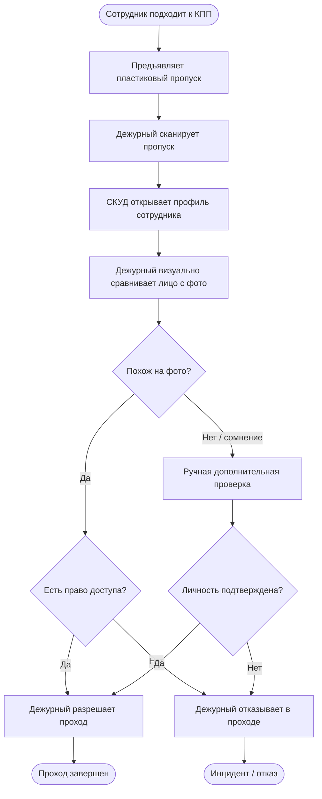

# Бизнес-процесс до внедрения системы

Диаграмма показывает текущий процесс ручной проверки личности на КПП. Основная проблема - решение зависит от внимательности дежурного и качества визуального сравнения человека с фотографией в профиле.

## Что не устраивает в текущем процессе

- Проверка субъективна и зависит от усталости дежурного.
- В часы пик визуальное сравнение выполняется быстрее и менее тщательно.
- Нет единого численного критерия уверенности.
- Сложно доказать, почему конкретный человек был допущен или отправлен на дополнительную проверку.
- Проход по чужому пропуску может быть не замечен, если человек похож на фото или дежурный ошибся.
